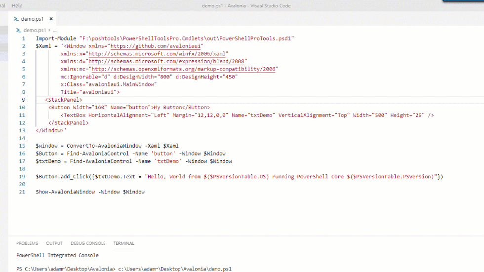

# PSAvalonia

Version 2.0

[Avalonia](http://avaloniaui.net/) bindings for PowerShell. I did not create these bindings, only added/improved them for extra features. You will have to add the .dll manually to the module, and replace the current ones in order to use. This module was written for Avalonia 0.8.2 version.

## This Fork Contains The Ability To Use ReactiveUI. This allows bindings. To give an example for reference:

```
$Xaml = Get-Content ".\gui\MainWindow.xaml"
$Xaml = $Xaml | Out-String
$window = convertTo-AvaloniaWindow -Xaml $Xaml


class viewmodelbase : ReactiveUI.ReactiveObject{}

class MainWindowViewModel : viewmodelbase {
    [String]$Greeting = "Hello World!"
}

$ViewModel = [MainWindowViewModel]::New()

$window.DataContext = $ViewModel
```

Will output "Hello World!"

This creates a new data context, with the binding of greeting. In the XAML:

```
<TextBlock Text="{Binding Greeting}" HorizontalAlignment="Center" VerticalAlignment="Center"/>
````

## Building Bindings

```
class MainWindowViewModel : ViewModelbase {
    [String]                 $Greeting = "Hello World"
    [stat[]]                 $Stats

    [void] Change_Stat([stat[]]$Data) {
        $This.Stats = $Data
        $this.RaisePropertyChanged("Stats")
    }

    [void] Change_Greeting([String]$Value) {
        $this.Greeting = $Value
        $this.RaisePropertyChanged("Greeting")
    }
}
```

In the above model, I can now change Greeting by simply calling:

```
$Window.DataContext.Change_Greeting("Whaaaazzzzuppp!")
```

Greeting will now switch from "Hello World!" to "Whaaaazzzuppp!" interactively.

## This Fork Also Allows DataGrids.

In our above class, MainWindowViewModel we have a property of $Stats. Lets make a class for it:

```
class stat {
    [string]$Type
    [string]$Name
    [string]$Item
    [string]$Value
    [string]$Total

    stat([string]$Type, [String]$Name, [string]$Item, [String]$Value, [String]$Total) {
        [string]$this.Type = $Type
        [string]$this.Name = $Name
        [string]$this.Item = $Item
        [string]$this.Value = $Value
        [string]$this.Total = $Total
    }
}
```

Now we can generate a new stat, but to build a data grid, we want multiple rows, so we make an array of stat.

```
$Stat_Array = @()
$Stat_Array += [stat]::New("Apple","Red Apple","Apple Jack Farms", "$10.00", "50")
$Stat_Array += [stat]::New("Corn","Yellow Corn","Farmer Dan", "$9.00", "25")
$Stat_Array += [stat]::New("Peppers","Red Peppers","Casa Peppers Ranch", "$5.50", "40")
```

Now we change the binding:

```
$Window.DataContext.Change_Stat($Stat_Array)
```

Now building a data grid, and binding the "Items" to 'Stats', will allow you see the grid.

```
<DataGrid AutoGenerateColumns="True" RowBackground="White" AlternatingRowBackground="LightGray" GridLinesVisibility="All" Name="Data_Grid" HorizontalGridLinesBrush="Black" VerticalGridLinesBrush="Black" HorizontalAlignment="Left" MaxWidth="722" IsReadOnly="True" Items="{Binding Stats}" />
```

## Note:

I am using the updated libs that are generated when I make a new avalonia project, within the net461 folder. The current library is out of date. I am downloading module, then copying new .dll into the 1.0 folder.

## Avalonia

[Avalonia is a WPF-style, cross-platform UI library](http://avaloniaui.net/). It works with .NET Core and on Linux, Windows and MacOS.

## Available Commands $ViewModel = [MainWindowViewModel]::New()

$config.Window.DataContext = $ViewModel

- Show-AvaloniaWindow
- ConvertTo-AvaloniaWindow
- Find-AvaloniaControl

## Example

```
$Xaml = '<Window xmlns="https://github.com/avaloniaui"
        xmlns:x="http://schemas.microsoft.com/winfx/2006/xaml"
        xmlns:d="http://schemas.microsoft.com/expression/blend/2008"
        xmlns:mc="http://schemas.openxmlformats.org/markup-compatibility/2006"
        mc:Ignorable="d" d:DesignWidth="800" d:DesignHeight="450"
        x:Class="avaloniaui.MainWindow"
        Title="avaloniaui">
   <StackPanel>
	<Button Width="160" Name="button">My Button</Button>
        <TextBox HorizontalAlignment="Left" Margin="12,12,0,0" Name="txtDemo" VerticalAlignment="Top" Width="500" Height="25" />
    </StackPanel>
</Window>'
$window = ConvertTo-AvaloniaWindow -Xaml $Xaml
$Button = Find-AvaloniaControl -Name 'button' -Window $Window
$txtDemo = Find-AvaloniaControl -Name 'txtDemo' -Window $Window
$Button.add_Click({$txtDemo.Text = "Hello, World from $($PSVersionTable.OS) running PowerShell Core $($PSVersionTable.PSVersion)"})
Show-AvaloniaWindow -Window $Window
```

_Script Running on Windows_



_Script Running on Linux_


## Supported PowerShell Versions

- 6.2 
- 7.0

## Direct Methods.

2.0 Contains methods on top of cmdlets.
```
[GUI]::CreateWindow([String]$xaml)
[GUI]::FindControl([String]$name)
[GUI]::ShowWindow([Window]$Window)
```
